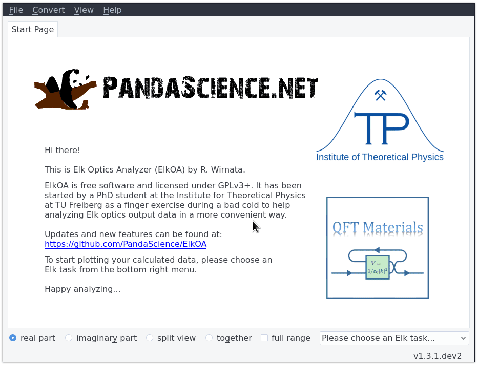

## Elk Optics Analyzer (ElkOA)
[](https://pypi.org/project/elkoa/)
[](https://pypi.org/project/elkoa/)
[](https://github.com/python/black)
[](http://www.gnu.org/licenses/gpl-3.0)
<!-- [](http://www.gnu.org/licenses/gpl-3.0) -->

> ⚠️ **NOTE**: You may also try the develop branch via `git clone -b develop ...` 

### Description
Elk Optics Analyzer (ElkOA) helps to analyze optics output data from 
[The Elk Code](http://elk.sourceforge.net).

### Features

Elk Optics Analyzer...

* Gives you quick and painless visual access to many ELK output files
* Comes with an easy to use GUI as well as a python CLI for experts
* Recognizes available tasks / (tensor) fields automatically
* Is easily extendable

Users can...

* Create and save publication-ready pictures via matplotlib's user interface
* Visualize real and imaginary parts of Elk optics output data in various ways
* Cycle through available datasets quickly via <kbd>Tab</kbd> and 
  <kbd>Shift+Tab</kbd>
* Select tensor elements to plot via dialog <kbd>Ctrl+T</kbd>
* Use global tensor elements settings across all available tasks <kbd>Ctrl+G</kdb>
* Batch-load parameter studies to visually analyze the impact of different
  parameter settings <kbd>Ctrl+B</kbd>
* Import and plot additional data files on top (e.g. experimental measurements)
  <kbd>Ctrl+O</kbd>
* Write out currently displayed data in different formats <kbd>Ctrl+W</kbd>
* Convert response functions via 
  [Universal Response Relations](https://arxiv.org/abs/1401.6800), e.g. ε ➙ σ
  <kbd>Ctrl+C</kbd> **⚠️ experimental❗**
* Convert dielectric tensors computed in the optical limit (q ➙ 0) 
  into ordinary and extra-ordinary refractive indices for arbitrary wavevectors 
  <kbd>Ctrl+C</kbd> **⚠️ experimental❗**

Possible new features for next releases:

* Most certainly and foremost: Bugfixes
* 3D-plotting of index ellipsoids
* Batch-convert for a set of different q-points
* Sample/geometry-dependent (i.e. thin films) conversions of response functions

### Requirements
* [Python 3.x](https://www.python.org)
* [numpy](https://www.numpy.org/)
* [matplotlib](https://matplotlib.org)
* [PyQt5](http://pyqt.sourceforge.net/Docs/PyQt5/installation.html)
* [pbr](https://docs.openstack.org/pbr/latest/)
* [wrapt](https://wrapt.readthedocs.io/en/latest/)
* [numexpr](https://numexpr.readthedocs.io/en/latest/)

You should use the packages provided by your linux distribution. On recent 
Debian systems for example, you can get all requirements by running
```bash
apt install python3-numpy python3-matplotlib python3-pyqt5 python3-pbr python3-wrapt python3-numexpr
```

Alternatively, you can get the latest PyPI versions of each package
automatically as dependencies by installing ElkOA via pip (see below).

For testing purposes, you additionally need the following packages:

* [pytest](https://docs.pytest.org/en/latest/)
* [pytest-qt](https://pytest-qt.readthedocs.io/en/latest/)
* [pytest-mpl](https://github.com/astrofrog/pytest-mpl)
* [nose](https://nose.readthedocs.io/en/latest/)

### Installation

The easiest way to install ElkOA is via pip, either from PyPI directly
```bash
pip install elkoa
```
or, if you want the latest git release, 
```bash
git clone https://github.com/PandaScience/ElkOpticsAnalyzer.git
cd ElkOpticsAnalyzer
pip install .
```
This will also install all required but absent python packages automatically
from PyPI.

If you like to install ElkOA only for the current user, add the flag `--user`.
If you want to take care of the required python packages yourself (i.e. by
using the ones provided by your Linux distribution), add `--no-deps`.  If you
like to run a developer installation (no copying of files, instead use git repo
files directly), add `-e`. 

**Note:** On newer systems you possibly encounter 
`error: option --user not recognized` during the developer installation. This
is due to a bug in pypa/setuptools and can be worked around using the flag 
`--no-build-isolation`. However, you then have to take care of all build
dependencies yourself.

For example, on my Arch Linux system, I use
`pip install --user --no-deps --no-build-isolation -e .`
within the repository's folder.

In any case, after installation you can run the ElkOA GUI from everywhere in a
terminal using either `elkoa` or `ElkOpticsAnalyzer`.

Another way to install is by cloning the repo as above and instead of
installing via pip, put something like
```bash
export PATH=$PATH:/path/to/ElkOpticsAnalyzer/elkoa/gui
export PYTHONPATH=$PYTHONPATH:/path/to/ElkOpticsAnalyzer/
```
to your `.bashrc` or `.bash_profile`. Then you can start the ElkOA GUI with
`ElkOpticsAnalyzer.py`.


### Tests

Testing is done using the `pytest` library. Make sure you installed all
additional requirements beforehand.

1. Download and extract the sample data
	- TODO
2. Run (--mpl flag is mandatory!)
```python
pytest test_figures.py --mpl
```


### Python CLI

In an Elk output directory containing e.g. the files
```bash
EPSILON_TDDFT_11.OUT EPSILON_TDDFT_12.OUT EPSILON_TDDFT_13.OUT 
EPSILON_TDDFT_21.OUT EPSILON_TDDFT_22.OUT EPSILON_TDDFT_23.OUT 
EPSILON_TDDFT_31.OUT EPSILON_TDDFT_32.OUT EPSILON_TDDFT_33.OUT elk.in INFO.OUT 
```
you can run in a python3 interpreter:
```python
# import helpful submodules from elkoa package
from elkoa.utils import elk, io, convert
# parse Elk input file
elk_input = elk.ElkInput(verbose=True)
eta = elk_input.swidth
# or read specific input parameter directly
eta = elk.readElkInputParameter("swidth")
# read tensorial Elk optics output (ij = dummy for 11, 12, etc.)
freqs, epsilon = io.readTensor("EPSILON_TDDFT_ij.OUT")
# find cartesian representation of q-vector from elk.in
q = elk_input.q_cart
# save crystal lattice vectors in cartesian basis as column-wise matrix
B = elk_input.B
# create converter instance with conventional frequency regularization
converter = convert.Converter(q, B, freqs, eta, reg="conv")
# convert dielectric tensor to optical conductivity
sigma = converter.eps_to_sig(epsilon)
# write out converted tensor
io.writeTensor("sigma_ij_test.dat", freqs, sigma, threeColumn=True)
# write out only 11 and 22 element of converted tensor
io.writeTensor("sigma_ij_test.dat", freqs, sigma, elements=[11, 22])
```


### Misc

* Loading additional data into existing plot:
  ElkOA supports auto-converting filenames to tex-labels. For this feature to
  work however, filenames must follow the pattern `root`+`_sub`+`.ext`, which
  will show up as root<sub>sub</sub>. In case `root` contains a
  case-insensitive substring like eps, EPSILON, Sig, SIGma etc., corresponding
  greek letters will be used, i.e. eps_ex.dat ➙ ε<sub>ex</sub>.
* The number of additional plots is restricted to 6, but in return we use 
  consistent coloring after consecutively adding more plots.


### Extend ElkOA

Users can extend ElkOA easily by modifying the file `elkoa/utils/dicts.py`, 
where all GUI-available tasks/output files, parameters and converters are set 
including naming of axes and tabs.

### Usage Examples GUI

#### Tensor plotting and "on-top-data"
  

#### Batch loading for parameter studies
  

#### Converter tools for response functions


➙ if images are not shown visit https://github.com/PandaScience/ElkOpticsAnalyzer/
